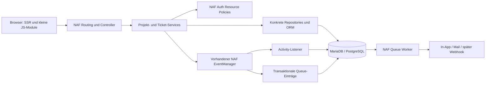

# Nafinity — technische Bestandsaufnahme und Architekturentscheidung

Stand: 14. September 2026. Arbeitsname: **Nafinity**. Geplanter Projektort: `/Users/flo/PhpStormProjects/nafinity`.

**Empfehlung:** Nafinity ist mit NAF gut umsetzbar. Routing, DI, SSR, Identity-Provider und Resource Policies passen zur Anwendung. Vor dem produktiven Einsatz müssen jedoch konkrete Integrationsfehler in Forms, Datenbank/Migrationen, ORM und Background Processing behoben werden. Die passende Antwort ist eine überschaubare Folge von Package-Verbesserungen und ein vertikaler Prototyp: anmelden → Projekt öffnen → Ticket erstellen → verschieben → Activity sehen → unberechtigten Zugriff ablehnen.

Der Prototyp soll bereits echte Persistenz und Rechte besitzen. Die vollständige produktive MVP-Fassung folgt darauf und ergänzt unter anderem Anhänge, vollständige Filter, Benachrichtigungen sowie LDAP/OIDC. Beide Stufen sind im [Prototyp- und MVP-Plan](Nafinity-Prototypplan.md) getrennt beschrieben.

## 1. Grundlage, Umfang und Verlässlichkeit

Analysiert wurden alle **20 öffentlich gelisteten Repositories** der GitHub-Organisation `nafphp`, ihre verfügbaren lokalen Gegenstücke, Manifeste, relevante Implementierungen, Bootstraps, Dokumentation und Tests. Der Abgleich erfolgte über die GitHub-API und Packagist, nicht nur über lokale Tags. Lokale Tags sind teilweise älter als der tatsächlich veröffentlichte Stand.

Zusätzlich geprüft: `fkde/aspx` am Git-Tree `e0671cf915863df2d1ceb72c190894823260b3c2`, NAF-Studio, NAF-Demo, `weonlywalk`, `website` und das tatsächlich laufende NixPHP-Studio. Das lokale CMS wurde hinsichtlich vorhandener Upload-Infrastruktur ergänzend gelesen. Es ist in der abgefragten öffentlichen NAF-Organisation nicht gelistet und keine Voraussetzung für Nafinity.

Die Package-Quellen stimmen mit dem verifizierten GitHub-`main` überein, mit folgenden Ausnahmen:

- `naf/mail`: veröffentlicht ist `0.2.1` bei `bee947ca99d9…`; lokal liegt der saubere Branch `v0.2.2-rc` bei `7f6ad246d075…`. Konfigurierbare Transport-Auflösung und `DummyTransport` sind dort vorhanden, aber kein verifiziert veröffentlichtes Feature von `0.2.1`.
- `docs`: lokaler Branch `docs/mail-transport` bei `558dc28e67fe…`; öffentlicher `main` bei `dada3799c12d…`. Die Mail-Dokumentation gehört zur noch gesonderten Änderung.
- `sanity`: zusätzliche unversionierte Traits/Funktionen; sie werden nicht als veröffentlichte API bewertet. `native` enthält ebenfalls unversionierte lokale Arbeit. Beide bleiben unberührt.

**Prüftiefe:** vollständiges Repository-/Capability-Inventar mit gezielter Codeanalyse der relevanten Abläufe; kein vollständiger formaler Security-Audit jeder Codezeile. Aussagen unterscheiden zwischen ausgeführtem Nachweis, Codebefund und noch zu validierendem Entwurf.

Die vorhandenen PHPUnit-Suites wurden in isolierten Kopien mit den vorhandenen Abhängigkeiten ausgeführt: **16 Packages, 927 Tests, 2.118 Assertions, alle erfolgreich**, PHP 8.5.4 / PHPUnit 12.5.35. Darunter ist die lokale Mail-RC-Suite. Dies ist keine vollständige PHP-/Datenbankmatrix und kein Nachweis, dass alle Transitivabhängigkeiten dieser einzelnen Vendor-Verzeichnisse dem aktuellen Stand entsprechen.

Zusätzliche Proben liefen gegen eigens angelegte PostgreSQL-17.11- und MariaDB-11.4.13-Container. Bestehende Projektdatenbanken wurden nicht verändert. Eine separate Composer-Fixture installierte Core plus alle 15 relevanten offiziellen Plugins per Path-Symlink; deren gemeinsamer CLI-Boot funktioniert auf dem Host. Nach Korrektur der Vendor-Links booten dieselben 15 Plugins außerdem gemeinsam unter PHP 8.3.15 im bestehenden Alpine-Image; 20 Commands und 14 Routen sind registriert. Reflection zeigt `/workspace/packages/framework/src/Core/App.php`; dessen SHA-256 stimmt mit der lokalen Source überein. `sanity` ist dabei bewusst nicht als stabiles Plugin einbezogen. Die maschinenlesbaren Ergebnisse stehen in [Analyse-Evidenz.json](../Analyse-Evidenz.json), die wichtigsten Reproduktionen in Framework-Findings.

## 2. Verfügbare Packages und geprüfte Versionen

| Package / Repository | Veröffentlicht | Geprüfter Commit | Rolle |
|---|---|---|---|
| [naf/framework](https://github.com/nafphp/framework) | v0.2.3 | `acabfb56a205` | Core |
| [naf/cli](https://github.com/nafphp/cli) | v0.2.1 | `e6606b08c514` | CLI |
| [naf/session](https://github.com/nafphp/session) | v0.2.1 | `9ace904401e7` | Sessions |
| [naf/database](https://github.com/nafphp/database) | v0.2.1 | `f2027ff9535b` | PDO und Migrationen |
| [naf/view](https://github.com/nafphp/view) | v0.2.1 | `d3414d396cf9` | SSR |
| [naf/client](https://github.com/nafphp/client) | v0.2.1 | `ee6b69eb7672` | PSR-18 HTTP |
| [naf/i18n](https://github.com/nafphp/i18n) | v0.2.1 | `f2ffaa81400a` | Übersetzungen |
| [naf/mail](https://github.com/nafphp/mail) | v0.2.1 | `bee947ca99d9`; lokal zusätzlich RC geprüft | E-Mail |
| [naf/mcp](https://github.com/nafphp/mcp) | v0.2.2 | `71d3b9523852` | MCP-Integration |
| [naf/sanity](https://github.com/nafphp/sanity) | kein verifiziertes Composer-Release | `17450365711e` | Experimenteller Aktions-Runner |
| [naf/form](https://github.com/nafphp/form) | v0.2.2 | `598bee7b0f46` | Validierung und CSRF |
| [naf/orm](https://github.com/nafphp/orm) | v0.2.1 | `b2f01d7a9cf7` | Entities und Repositories |
| [naf/queue](https://github.com/nafphp/queue) | v0.2.2 | `699b80dccad8` | Hintergrundjobs |
| [naf/schedule](https://github.com/nafphp/schedule) | v0.2.2 | `86732ec210f9` | Zeitplanung |
| [naf/auth](https://github.com/nafphp/auth) | v0.2.1 | `3b721331c734` | Login, Permissions, Policies |
| [naf/app](https://github.com/nafphp/app) | v0.2.2 | `536c1587d587` | Starter |
| [naf/oauth-client](https://github.com/nafphp/oauth-client) | v0.2.2 | `2260203bd8eb` | Externe Anmeldung |
| [naf/oauth-server](https://github.com/nafphp/oauth-server) | v0.2.2 | `62c1985ce4dc` | Eigener OAuth/OIDC-Provider |
| [docs](https://github.com/nafphp/docs) | kein verifiziertes Composer-Release | `dada3799c12d`; lokaler Doku-Branch separat | Dokumentation |
| [.github](https://github.com/nafphp/.github) | kein verifiziertes Composer-Release | `b836ffdbe06d` | Organisationsprofil |

`naf/cms`, `studio` und `native` existieren zusätzlich lokal. Das CMS besitzt appbezogene Infrastruktur; Studio liefert ein Docker-Vorbild; Native ist experimentell. Keine dieser Komponenten wird als Grundlage der Ticket-Domain installiert. `naf/sanity` ist ein früher Aktions-Runner, dessen `Runtime::run()` Aktionen lädt und per `var_dump()` ausgibt. Es ersetzt keine Testinfrastruktur und hat im MVP keine Aufgabe.

## 3. Wie NAF tatsächlich aufgebaut ist

**Boot und Plugins.** `Naf\app()` erzeugt lazily eine `App` mit `AutoResolvingContainer(new Container())`. Boot lädt Umgebung, Core-Services, installierte Composer-Packages vom Typ `naf-plugin`, App-Routen und HTTP-Guards. Erst werden alle Plugins registriert, anschließend gebootet. Ein gemountetes Verzeichnis allein wird dadurch nicht zum installierten Plugin. `app/plugins.php` beeinflusst die Reihenfolge, ist aber weder Installer noch Allowlist. Der Core selbst ist eine Composer-Library. [App-Boot](https://github.com/nafphp/framework/blob/acabfb56a205b9134c1dc61274e2aa9b5fbf574a/src/Core/App.php#L359)

**DI.** Konkrete Klassen lassen sich durch `make()` per Konstruktor auflösen. `get()` liefert registrierte Services; fehlende konkrete Klassen werden dort nicht automatisch gebaut. Interface-/Scalar-Abhängigkeiten benötigen Bindings bzw. Fabriken. Controller, Listener-Klassen und Commands verwenden den vorhandenen Container. Keine Controller-Basisklasse und keine Service-Interfaces ohne Austauschbedarf.

**Konfiguration.** PHP-Arrays, Merge Core → Plugins → App mittels `array_replace_recursive`; Zugriff etwa `config('database:host')`. Numerische Listen werden positionsweise überschrieben. `.env.local` ersetzt `.env`. Werte werden nicht wie in einer Shell interpoliert oder automatisch typisiert. `ENV:KEY` liest `$_ENV`, während Container-Environment je nach PHP-Konfiguration nur über `getenv()` verfügbar ist. Das ist im Docker-Setup ausdrücklich zu testen. [Konfiguration](https://github.com/nafphp/framework/blob/acabfb56a205b9134c1dc61274e2aa9b5fbf574a/src/Core/Config.php)

**HTTP.** PSR-7-Requests/Responses über Nyholm; Router mit benannten Routen, Pfadparametern und Methodenvergleich. Dispatch reicht benannte Pfadparameter weiter, keine Action-Parameter-DI. `param()` kombiniert Query, Formular und teilweise JSON; es ist kein Validator. Mutationen lesen ausschließlich den erwarteten Body, verwenden eine Feld-Allowlist und lehnen ungültiges JSON ausdrücklich ab. Route-IDs bleiben einfache validierte IDs; freier Text wird nicht ungeprüft in Route-Platzhalter gesteckt.

**Fehler und Logs.** `abort()`, HTTP-Exceptions, `Event::EXCEPTION`, sanitisiertes Fehler-HTML für `test`/`prod` und PSR-3-Logging sind vorhanden. Interne JSON-Endpunkte erhalten einen appbezogenen Exception-Listener mit konsistentem Fehlerformat. Achtung: ein unbekannter nichtleerer `APP_ENV` wie `production` erzeugt momentan detaillierte Fehleransichten. Deshalb `prod` verwenden und diesen Default im Core härten. Log ist Infrastruktur; die Ticket-Historie gehört in eigene Activity-Datensätze.

**Events.** Ein synchroner `EventManager` mit Stringnamen, beliebigen Payloads, Prioritäten und Klassen-/Closure-Listenern reicht für Domain-Events. Listener-Exceptions propagieren. Es gibt keine automatische Commit-Kopplung. `response.header` unterstützt eine zurückgegebene Response; bei mehreren Listenern erhält nicht automatisch jeder das Ergebnis seines Vorgängers. Sicherheitsheader deshalb zentral in einem Listener oder in Nginx setzen. [EventManager](https://github.com/nafphp/framework/blob/acabfb56a205b9134c1dc61274e2aa9b5fbf574a/src/Core/EventManager.php)

**Persistenz.** `naf/database` stellt PDO und Migrationen bereit. `naf/orm` ergänzt Entities, Repositories, Relationserkennung und einen EntityManager mit Savepoints. Es gibt keine automatische Schemaerzeugung und kein Lazy Loading. Komplexe projektgebundene SQL-Abfragen über PDO sind eine vorgesehene NAF-Nutzung, kein Framework-Workaround. CRUD-Mapping sollte der ORM übernehmen, sobald die unten benannten Vertragsfehler korrigiert sind.

## 4. Eignungsmatrix A / B / C

A = unmittelbar nutzbarer Teilumfang. B = vorhanden, benötigt eine generische Korrektur/Erweiterung oder hat eine relevante Grenze. C = notwendige Funktion nicht als passende Infrastruktur vorhanden. Eine B-Wertung bedeutet nicht, dass das gesamte Package ungeeignet ist.

| Bereich | Bewertung | Konkreter Befund / Entscheidung | Eigentümer der Ergänzung |
|---|---|---|---|
| Core-Boot / Extension-Architektur | A | Composer-Discovery, Ressourcen, Zwei-Phasen-Boot vorhanden; 15 Plugins gemeinsam gebootet | `APP`: Auswahl, Konfiguration und Integrationstests |
| Routing | A | Benannte Routen und kleine HTML-/JSON-Endpunkte passen; keine automatische Resource-Autorisierung erwarten | `APP` |
| DI | A/B | Konstruktor-Injection, konkrete Services, Interface-Bindings; ein Service, dessen Factory `null` liefert, verschwindet nach dem ersten Zugriff | `NAF CORE` F18; Bindings `APP` |
| Configuration | A/B | Merge und ENV ausreichend; Umgebungswerte bewusst lesen, sichere Fehler-Defaults nachbessern | `APP`, `NAF CORE` F16 |
| Events | A/B | Domain-Events passen; Objekt-Callable verursacht TypeError, obwohl als callable zulässig | `NAF CORE` F09; Eventnamen/Payloads `APP` |
| Request / Response | A/B | PSR-7 und JSON vorhanden; Ausgabe großer Streams puffert den Body als String | `NAF CORE` F10; DTO/Input-Form `APP` |
| Error Handling | A/B | HTTP-Status und Exception-Hook vorhanden; unbekannte Environment-Werte sind zu freizügig | `NAF CORE` F16; JSON-Fehlerformat `APP` |
| Views | A | PHP-Templates, Layout-Blöcke, Partials, CSS-/ES-Module-Assets, explizites Escaping | `APP`: UI und Designsystem |
| Forms / Validation | B | Regel-Registry vorhanden; Typ-/Array-/Integer-/Datumsregeln fehlen, `required` basiert auf `empty()` | `EXISTING NAF PLUGIN` F11; Domainregeln `APP` |
| CSRF | B | POST/PUT/DELETE geprüft; PATCH ungeprüft, Bearer-Header pauschal ausgenommen, erneutes Generate invalidiert andere Tabs | `EXISTING NAF PLUGIN` F01 |
| Session | A/B | File-Sessions, Cookie-Flags, Proxy-Trust und Sessionrotation vorhanden; DB-Backend nicht MariaDB-/PG-kompatibel genug | `EXISTING NAF PLUGIN` F04; Cookie-/INI-Konfiguration `APP` |
| Database | B | MariaDB-PDO funktioniert; PostgreSQL scheitert an `charset` im DSN; allgemeines PDO-Servicebinding fehlt; fehlende Config wird als `null` statt als Fehler ausgedrückt | `EXISTING NAF PLUGIN` F02/F17/F18 |
| ORM | B | Leichtes Mapping und Savepoints passen; Tabelle wird für Lesen/Schreiben unterschiedlich bestimmt, externe PDO-Transaktion kollidiert | `EXISTING NAF PLUGIN` F05/F06 |
| Migrations | B | Registry und CLI vorhanden; Tracker/SQL, Reihenfolge, Rückbau und Identität müssen robuster werden | `EXISTING NAF PLUGIN` F03/F04 |
| Lokale Authentifizierung | A | PasswordHasher, Password-/Database-/ORM-Provider, eigenes Identity-/User-Modell, Sessionrotation | `APP`: Kontenverwaltung und UI |
| Rollen / globale Permissions | A | `can`, `canAny`, Rollen, `requirePermission`; Grants werden aus dem User gelesen | `APP`: definierte Rollenzuordnung |
| Resource Policies | A | `policy()` / `allows()`; deny-by-default, globale Grants überstimmen Resource-Deny nicht | `APP`: Projekt-, Ticket-, Kommentar-, Attachment-Policies |
| LDAP | C | Provider-Vertrag vorhanden, LDAP-Provider nicht vorhanden | `NEW NAF PLUGIN` F12: optionales `naf/auth-ldap` |
| OAuth / OIDC Client | A/B | State, Nonce, S256-PKCE, ID-Token/JWKS/Issuer/Audience, Linking vorhanden; Datenbank-/ORM-Unterbau noch B | `APP`: Provisionierung/Policy; bestehende Plugin-Fixes |
| OAuth / OIDC Server | A für vorhandene Protokollbasis | Umfangreich vorhanden, für externes Login nicht erforderlich; optionaler Integrations-Testpartner | `APP`: späteres Lab-Profil, nicht Produkt-MVP |
| Queue | B | File-/SQLite-Driver, Channels, Retry und Deadletter vorhanden; keine Crash-sichere Reserve/Acknowledge-Semantik | `EXISTING NAF PLUGIN` F07 |
| Scheduler | B | Cron, Ticker und Coalescing vorhanden; falscher Worker-Befehl, nicht atomarer/shared State, keine Nachholung | `EXISTING NAF PLUGIN` F08; fachliche Nachholung `APP` |
| CLI | A | Registry, Commands und Prozess-Exitcodes vorhanden | `APP`: Setup-/Seed-/Diagnose-Commands |
| Mail | A/B | Nachrichten und Transportvertrag vorhanden; RC erleichtert Overrides; kein verifiziert ausgelieferter SMTP-Transport | `EXISTING NAF PLUGIN` F15; Empfänger/Templates `APP` |
| HTTP Client | A | PSR-18, cURL, CA-Handling, Timeout, pro Instanz Optionen; OAuth unterbindet Retry/Redirect | `APP`: bewusste Retry-/Endpoint-Policies |
| Logging | A | PSR-3 austauschbar; Container-Logs/Rotation konfigurierbar | `APP`, keine neue Log-API nötig |
| Upload / privater Storage | C auf Plugin-Ebene | PSR-7-Uploads vorhanden; keine passende generische private Dateiablage; CMS-Code ist gekoppelt | `NEW NAF PLUGIN` F13 |
| Geschützter Download | B/C | Response möglich, aber weder Datei-Policy noch kompletter sicherer Storage-Ablauf | Storage F13 / Streaming F10; Policy `APP` |
| Login Rate Limiting | C | Im Auth-Package ausdrücklich der Anwendung überlassen; wiederverwendbare Counter-Infrastruktur fehlt | `NEW NAF PLUGIN` F14; Schwellen/Schlüssel `APP` |
| Testing | A/B | Bestehende Tests nutzbar; relevante reale DB-/CLI-/Browser-Kombinationen fehlen | Bestehende Package-Suites + `APP`-Integrationsmatrix |
| Activity / Notifications | C als Produktfunktion | Events verfügbar, keine fertige Ticket-Historie oder Notification-Domain | `APP`, zunächst kein generisches Activity-Package |
| Volltext / Saved-Filter-Modell | C als Produktfunktion | SQL ist verfügbar; keine Ticket-Suchsemantik | `APP`, zwei SQL-Dialekte im Query-Code |
| Persistente Reihenfolge / Moves | C als Produktfunktion | Transaktions-/SQL-Primitiven vorhanden | `APP`, kein vorsorgliches Ordering-Package |
| i18n | A für einfache Übersetzung | JSON-Kataloge, Locale, Platzhalter; keine aus der Profilbeschreibung ableitbare vollwertige ICU-Engine | `APP`: Texte, Locale-/Zeitzonenpräferenz |
| MCP | A für vorhandenen Tool-Transport | Authentifizierte JSON-RPC-Tools, Scopes und Token-Store; kein Live-Board-Push, keine automatischen Projekt-Policies | `APP`: später explizite Tools/Policy-Brücke |

Die konkreten B-/C-Infrastrukturpunkte mit Ursachen, kleinster API-Änderung, BC und Tests stehen im Findings-Protokoll. Es werden keine Ticketfelder, Boardzustände oder Rollen in den Core aufgenommen.

## 5. Architektur von Nafinity



`Controller → Service → Policy + Validation → Repository → Datenbank` ist die verbindliche Schreibrichtung. Ein Service besitzt die Transaktionsgrenze. Policies enthalten fachliche Rechteentscheidungen; Repositories führen projektgebundene SQL-Abfragen aus. Reine Board-Leseansichten dürfen optimierte Join-/Batch-Abfragen verwenden. Ein Repository-Interface pro Tabelle wird nicht eingeführt.

**ORM-Nutzung:** Eigene einfache Entities und wenige fachlich passende Repositories. Keine Business-Logik in einem Active Record. Ticket-Assignees/-Labels sind explizite Datensätze mit Projektbezug; generische Relationserkennung darf diese Regeln nicht umgehen. Datumswerte/Enums werden bewusst gemappt: `EntityTrait` persistiert skalare bzw. null-Werte, nicht automatisch beliebige Value Objects. Optimistic-Locking-Updates und Multi-Tenant-Bedingungen sind konkrete Repository-Operationen.

**Services:** `ProjectService`, `BoardService`, `TicketService`, `CommentService`, `AttachmentService`, `NotificationService`; dazu `BoardQuery` bzw. fachliche Read-Methoden, ein `AccountService` für lokale Provisionierung und explizite Jobs. Shared Dienste per Factory binden. Ein Service-Interface wird nur bei tatsächlichem Austauschbedarf ergänzt.

**Transaktionen:** Innerhalb einer Operation derselbe PDO und, bei ORM-Schreibzugriffen, derselbe EntityManager. Bis zur generischen Korrektur F06 darf nicht zwischen einer selbst geöffneten PDO-Transaktion und einem unabhängig begonnenen EntityManager-Save gewechselt werden. Geplante stabile Lösung: klare Transaktionseigentümerschaft und Savepoints bei bereits vorhandener Fremdtransaktion. Kein eigenständiges Transaktionsframework.

Dass beide dieselbe Verbindung sehen, ist strukturell gegeben und nicht bloß Konvention: `Container::get()` ersetzt die Factory durch ihr Ergebnis, `Database::class` ist damit faktisch Singleton, und `orm/bootstrap.php` baut EntityManager und RepositoryFactory beide aus `Database::getConnection()`. Autowiring erzeugt ebenfalls keine zweite Instanz, weil Klassenabhängigkeiten zuerst über `get()` aufgelöst werden und erst bei `ServiceNotFoundException` auf `make()` fallen.

**Verbindliche Reihenfolge, solange F06 offen ist:** Der EntityManager eröffnet die Transaktion (`$em->begin()`), und erst danach laufen rohe Anweisungen wie `SELECT … FOR UPDATE` über dieselbe PDO innerhalb dieser Transaktion. Die umgekehrte Reihenfolge — roher `beginTransaction()`, anschließend `$em->begin()` — ist exakt F06 und wirft `There is already an active transaction`. Die PDO wird dafür getrennt bezogen, weil `EntityManager` weder einen Accessor noch eine Query-Methode anbietet: bis F17 über `get(Database::class)->getConnection()`, danach über `PDO::class`. Diese Regel ist der Grund, warum der Moveablauf in Abschnitt 8 die Transaktionseröffnung ausdrücklich dem EntityManager zuweist.

## 6. Domain-Modell und Datenbankschema

Ein **Project** ist die fachliche Zugriffsgrenze. Ein **Board** gehört zu einem Project und besitzt Columns und Swimlanes. Im MVP existiert genau ein Board je Projekt, im Schema sind mehrere später möglich. Das trennt Team/Permissions von Darstellung, ohne heute Multi-Board-Verwaltung zu bauen.

Ein Ticket hat einen eigenen Lebenszyklus `open`/`closed`; Columns beschreiben seinen Arbeitsablauf. Archiviert wird über `archived_at`, nicht über einen widersprüchlichen dritten Status. Eine Column hat optional `closes_tickets`; ein Move wendet die damit verbundene Status-/Zeitstempeländerung atomar an. Jede Board-Struktur enthält mindestens eine echte Default-Swimlane. Kein `NULL` für „keine Swimlane“, weil das Eindeutigkeit und Positionsindizes unnötig erschwert.

Alle unten genannten Tabellen sind **`APP`**, ausgenommen ausdrücklich markierte Plugin-Tabellen. IDs sind BIGINT, projektübergreifend eindeutig; an JSON/JavaScript gehen sie als Strings. Ein normaler numerischer Primärschlüssel genügt, die Sicherheit entsteht durch Policies und Projektbindung. Zeitstempel werden als UTC-Mikrosekundenwerte in geeigneten relationalen Timestamp-/Datetime-Spalten gespeichert. `due_date` ist ein Datum ohne Uhrzeit. PostgreSQL-/MariaDB-DDL wird jeweils explizit in den vorhandenen Migrationen erzeugt.

| Tabelle / Objekt | Wesentliche Felder | Beziehungen und Integrität |
|---|---|---|
| `users` / User | id, username, username_normalized, email, display_name, password_hash nullable, is_active, global_role, created_at, updated_at | Unique username_normalized; eigenes `UserInterface`; externe Konten brauchen keinen lokalen Hash; E-Mail nie automatischer Linking-Schlüssel |
| `projects` / Project | id, key, name, description, color, icon, next_ticket_number, archived_at, created_by, created_at, updated_at | Unique key; Creator → users; Archivierung stoppt Mutationen außer Restore |
| `project_members` / ProjectMember | project_id, user_id, role, state, joined_at, updated_at | PK(project_id,user_id), FKs auf Project/User; Rolle owner/manager/member/viewer; inaktive Membership bleibt bei Bedarf für Historie erhalten |
| `boards` / Board | id, project_id, name, revision | Unique(project_id,id); MVP ein Board per Project durch Setup/Service; spätere Boardanzahl ohne Migration der Ticket-Domain erweiterbar |
| `board_columns` / Column | id, project_id, board_id, name, position, closes_tickets, wip_limit nullable | FK(project_id,board_id) → boards; Unique(project_id,board_id,id); WIP zunächst nur vorbereitet |
| `board_swimlanes` / Swimlane | id, project_id, board_id, name, position, is_default | FK(project_id,board_id) → boards; Unique(project_id,board_id,id); Default-Lane bleibt existent |
| `tickets` / Ticket | id, project_id, board_id, number, column_id, swimlane_id, title, description, priority, color, status, position, version, creator_id, due_date, created_at, updated_at, closed_at, archived_at | Unique(project_id,number), Unique(project_id,id); zusammengesetzte FKs auf Board/Column/Swimlane; Creator → users |
| `labels` / Label | id, project_id, name, name_normalized, color | Unique(project_id,name_normalized), Unique(project_id,id) |
| `ticket_labels` / TicketLabel | project_id, ticket_id, label_id | PK(project_id,ticket_id,label_id); zusammengesetzte FKs auf Ticket und Label desselben Projekts |
| `ticket_assignees` / TicketAssignee | project_id, ticket_id, user_id, assigned_by, created_at | PK(project_id,ticket_id,user_id); FK(project_id,ticket_id) → tickets; FK(project_id,user_id) → project_members; aktive Membership zusätzlich im Service prüfen |
| `comments` / Comment | id, project_id, ticket_id, author_id, body, version, created_at, updated_at, deleted_at | FK(project_id,ticket_id) → tickets; Autor → users; Soft Delete für nachvollziehbaren Verlauf |
| `attachments` / Attachment | id, project_id, ticket_id, uploaded_by, storage_key, original_name, mime_type, size_bytes, sha256, state, created_at, deleted_at | FK(project_id,ticket_id) → tickets; Unique storage_key; state staged/ready/deleting; Blob außerhalb public |
| `activities` / Activity | id, event_id, project_id, actor_id nullable, resource_type, resource_id, event, payload_version, payload_json, occurred_at | Unique event_id; Projekt-FK; polymorphe Resource absichtlich ohne unmöglichen generischen FK, Schreiben nur über kontrollierten Service/Listener |
| `notifications` / Notification | id, user_id, project_id, activity_id, kind, read_at, created_at | Unique(user_id,activity_id,kind); Projektzugriff bei jeder Anzeige erneut prüfen |
| `user_preferences` / UserPreference | user_id, theme, locale, timezone, notification_settings_json | PK/FK user_id; theme system/light/dark; flexibles JSON nur für bewusst versionierte Kanalpräferenzen |
| `project_preferences` / ProjectPreference | project_id, settings_version, settings_json | PK/FK project_id; nur optionale Settings, keine Mitglieder/Labels/Columns im JSON |
| `ldap_identities` | directory_key, subject, user_id, last_verified_at | Unique(directory_key,subject); stabiler Directory-Identifier, kein DN/E-Mail als dauerhafte Identität; Mapping `APP`, LDAP-Verifikation Plugin |
| `oauth_identities` | vorhandenes Schema des OAuth-Client-Plugins | **`EXISTING NAF PLUGIN`**; Issuer+Subject-Linking wiederverwenden, keine parallele OAuth-Identity-Tabelle |
| `queue_jobs` | id, class, payload, channel, status, available_at, reserved_until, reservation_token, attempts, last_error, created_at | **`EXISTING NAF PLUGIN`**, Entwurf F07; beanspruchbare persistente Jobs auf derselben DB-Verbindung |
| `notification_deliveries` | activity_id, user_id, channel, status, attempts, sent_at | Unique(activity_id,user_id,channel); `APP`-Idempotenz und sichtbare Zustellzustände, sobald externe Benachrichtigungen gebaut werden |

**Konkrete zusammengesetzte FKs:**

- `tickets(project_id, board_id, column_id) → board_columns(project_id, board_id, id)`.
- `tickets(project_id, board_id, swimlane_id) → board_swimlanes(project_id, board_id, id)`.
- `ticket_labels(project_id, label_id) → labels(project_id, id)`.
- `ticket_assignees(project_id, user_id) → project_members(project_id, user_id)`.
- `comments` und `attachments` referenzieren `tickets(project_id,id)`.

Damit scheitert eine Mischung von Ressourcen aus Project A/B selbst dann, wenn ein Service versehentlich eine Bedingung vergisst. Die Indexreihenfolgen und die referenzierten Unique-Keys werden in beiden echten Datenbanken getestet. IDs/FK-Typen und bei Textschlüsseln deren Collations müssen exakt zueinander passen.

**Wichtige Indizes:**

- Board-Aufbau: `tickets(project_id,board_id,column_id,swimlane_id,position,id)`; eindeutige Position je Zelle über `(project_id,board_id,column_id,swimlane_id,position)`.
- Kartenfilter: `(project_id,status,priority)`, `(project_id,due_date)`, Label-/Assignee-Zuordnungen zusätzlich in umgekehrter Suchrichtung `(project_id,label_id,ticket_id)` und `(project_id,user_id,ticket_id)`.
- Ticket-Verlauf: `comments(project_id,ticket_id,created_at,id)`; `activities(project_id,resource_type,resource_id,occurred_at,id)`.
- Notifications: `(user_id,read_at,created_at,id)`; Queue: `(channel,status,available_at,id)` und Lease-Ablauf.
- Volltext: MariaDB-FULLTEXT auf title/description; PostgreSQL-GIN auf einer passenden `tsvector`-Expression. Keine allgemeinen Versprechen identischer Sprach-/Rankingsemantik.

**Löschen und Membership:** Projekte werden zunächst archiviert. Beim Entfernen eines Mitglieds werden offene Zuweisungen in derselben Transaktion aufgelöst und die Membership deaktiviert; Kommentare/Activities bleiben nachvollziehbar. Keine Kaskade löscht unbemerkt die Historie. Letzter aktiver Owner darf weder entfernt noch herabgestuft werden. Reassign, Member-Entzug und Ticket-Mutation nutzen dieselbe Sperrdisziplin.

## 7. Autorisierung und Login

Globale Rollen besitzen eine kleine feste Mapping-Tabelle im PHP-Code, z. B. `user` und `administrator`; daraus stammen Permissions wie `projects.create`, `administration.access`, `users.manage`. Noch kein UI zum freien Zusammenstellen einer globalen RBAC-Matrix.

Projektrollen stehen in `project_members` und werden **nicht** zu globalen Permissions aufgebläht. Eine globale Admin-Permission gewährt nicht automatisch Leserechte auf alle Projektinhalte. Falls ein administrativer Override gewünscht wird, ist er explizit in der Policy und der Activity-Historie abzubilden.

| Aktion | Viewer | Member | Manager | Owner |
|---|---:|---:|---:|---:|
| Projekt/Board/Ticket anzeigen | ja | ja | ja | ja |
| Ticket erstellen/bearbeiten/verschieben | nein | ja | ja | ja |
| Kommentieren / Datei anhängen | nein | ja | ja | ja |
| Eigenen Kommentar/Anhang bearbeiten bzw. entfernen | nein | ja | ja | ja |
| Fremden Kommentar/Anhang moderieren | nein | nein | ja | ja |
| Columns/Swimlanes/Labels verwalten | nein | nein | ja | ja |
| Mitglieder verwalten | nein | nein | bis Member/Viewer | ja, mit Last-Owner-Schutz |
| Projekt archivieren / Owner vergeben | nein | nein | nein | ja |
| Ticket löschen | nein | nein | ja | ja |

Alle „ja“ gelten nur bei aktivem User, aktiver Membership und nicht archiviertem Project. Weitere produktbezogene Regeln bleiben veränderbar in den Policies. Kommentarbesitz allein ersetzt nie die Projektmitgliedschaft.

**Services sind die Sicherheitsgrenze.** Ein Ticket wird per `(project_id,ticket_id)` geladen, anschließend `auth()->allows('move', $ticket)` geprüft. Bei fehlender Policy wird abgelehnt. Fremde Projektressourcen erhalten eine konsistente 404-Antwort; ein bekanntes Projekt mit unzureichender Rolle eine 403. Listen, Trefferzahlen, Filteroptionen, Downloads und Notifications benötigen dieselbe Isolation wie Mutationen.

**Lokale Anmeldung:** vorhandener Password-/ORM- oder DatabaseProvider, `PasswordHasher`, `SessionStateStore`. Eigener User implementiert `UserInterface` einschließlich Aktivstatus. Keine zweite Passwortprüfung und kein manuelles Setzen einer Session-User-ID. Provisionierung zunächst per CLI; öffentliche Selbstregistrierung gehört nicht zum MVP.

**LDAP:** optionales `naf/auth-ldap`, implementiert den bestehenden `ProviderInterface`. Verifikation mit TLS, geprüfter Server-CA, escaped Search-Filtern, separater Connection für User-Bind, abgelehntem Leerpasswort und kontrollierten Timeouts. Ein Callback bzw. kleiner Mapper ordnet einen stabilen Directory-Identifier dem lokalen User zu. `find()` lädt den lokalen User und beachtet Deaktivierung; die Frist für Directory-Revalidierung und Directory-Ausfälle wird explizit festgelegt. Kein Directory-Bind bei jedem Board-Fragment und kein stilles Passwort-Fallback.

**OIDC/OAuth:** vorhandenen OAuth-Client und seine `Accounts`-/Linking-Mechanik verwenden. Login-Quelle (`auth:logins`) ist nicht dasselbe wie die lokale Kontenquelle (`auth:providers`). Bei mehreren Kontenquellen wird der Owner externer Links explizit gesetzt. Issuer+Subject ist die Identität, niemals allein E-Mail. Auto-Provisionierung standardmäßig aus; wenn aktiviert, nur für erlaubte Issuer und weiterhin ohne automatische Projektmitgliedschaft. OAuth-Server wird dafür nicht benötigt. Externe Provider-Tokens nur speichern, wenn eine Integration sie tatsächlich benötigt.

## 8. Kartenpositionierung und gleichzeitige Änderungen

**Entscheidung `APP`: Sparse Integer Ordering mit BIGINT, Abstand 1.024.** Es ist einfacher zu prüfen und zwischen MariaDB/PostgreSQL zu portieren als eine eigene LexoRank-/Fractional-Indexing-Implementierung. Kein Floating Point und keine vollständige Neunummerierung bei jedem Move.

Erster robuster Ansatz für interne Teams: Eine kurze Schreibtransaktion sperrt die Project-Zeile mit `SELECT … FOR UPDATE`. Alle projektbezogenen Mutationen, einschließlich Membership-Änderungen, Strukturänderungen und Moves, halten sich daran. Damit sind Berechtigungsprüfung und Mutation gegenüber einem gleichzeitigen Rechteentzug geordnet. Die absichtlich grobe Sperre serialisiert Schreiboperationen eines Projekts, nicht alle Projekte. Für den ersten Prototyp ist das ein guter, messbarer Einfachheitskompromiss. Externe I/O erfolgt niemals unter dieser Sperre.

Ablauf eines Moves:

1. User und projekteigene Ressource identifizieren; Schreibtransaktion **über den EntityManager** öffnen, erst danach die Project-Zeile per `SELECT … FOR UPDATE` über dieselbe PDO sperren, dann Aktivstatus/Membership/Archivierung unter Sperre erneut prüfen. Die Reihenfolge ist verbindlich und in Abschnitt 5 begründet; ein roher `beginTransaction()` vor `$em->begin()` läuft in F06.
2. Ticket und Ziel-Column/-Swimlane im selben Board/Project laden. `expected_version` und `expected_board_revision` mit dem Client vergleichen.
3. Client sendet Zielzelle und Nachbar-IDs, **keine frei gewählte numerische Position**. Server prüft, dass die Nachbarn zur Zelle gehören und in der kanonischen ungefilterten Reihenfolge benachbart sind.
4. Zwischen `left` und `right`: `left + intdiv(right-left, 2)`. Am Ende `left + 1024`; am Anfang zwischen 0 und erstem Wert. Vor jeder Operation Grenzen prüfen.
5. Nur wenn kein Abstand mehr bleibt: betroffene Zelle deterministisch neu verteilen, einschließlich dort verbleibender geschlossener/archivierter Datensätze, die denselben Unique-Index belegen. Wegen Unique-Constraint zweistufig in temporäre eindeutige negative Positionen, dann auf positive Vielfache von 1.024. Negative Werte sind nur innerhalb der nicht sichtbaren Transaktion zulässig; kein DB-CHECK, der diese temporäre Phase verhindert. Abschließend Invariante prüfen.
6. Ticket, Status/closed_at und Versionszähler schreiben; Board-Revision erhöhen; genau einen fachlichen Activity-Eintrag für den Move erzeugen. Technisches Rebalancing erzeugt keine künstliche Flut an TicketMoved-Events.
7. Commit und kanonische Karte/Zelle zurückgeben. Veraltete Version → 409 mit aktualisierbarer Sicht, keine still verlorene Änderung.

Deadlocks/Serialization-Fehler: begrenzte Wiederholung der gesamten Transaktion nur für erkannte DB-Konflikte. Fachliche Konflikte werden nicht blind wiederholt. Bei späteren projektübergreifenden Operationen gilt eine sortierte Sperrreihenfolge; solche Moves sind im MVP nicht erlaubt.

**Gefilterte Boards:** Im ersten Prototyp ist freies Umordnen bei aktivem Filter deaktiviert; ein expliziter Move in eine Zielspalte bleibt möglich und fügt dort am Ende ein. So behauptet ein sichtbarer Nachbar nicht fälschlich, direkt neben einer ausgeblendeten Karte zu liegen. Eine spätere verbesserte Interaktion muss weiterhin die kanonische Reihenfolge beachten.

Zu messen: 95%-Latenz für einen Move bei zwei parallelen Sessions, Lock-Wartezeit, Konfliktrate, Rebalance-Häufigkeit. Erst bei realen Engpässen feiner pro Board/Zelle sperren. Die HTTP-Semantik bleibt dabei gleich.

## 9. Events, Activity und Benachrichtigungen

**`APP`-Events:** `TicketCreated`, `TicketUpdated`, `TicketMoved`, `TicketAssigned`, `TicketCommented`, `TicketClosed`, `ProjectCreated`, `ProjectMemberAdded`; dazu MemberRemoved, AttachmentAdded/Removed bei den betreffenden Features. Dispatch beispielsweise über den vorhandenen String-Key `ticket.moved` und ein unveränderliches Payload-Objekt. Kein EventBus-Wrapper.

Payload: event_id, project_id, actor_id, resource_type/id, occurred_at, schema_version, relevante vorherige/neue Werte. Keine Passwörter, Sessiondaten, LDAP-Credentials, Provider-Tokens oder Attachment-Binaries. Beschreibungsinhalte werden nicht unbesehen in jeden Event kopiert.

**Atomarität:** Fachliche DB-Änderung und Activity-Zeile entstehen in einer Transaktion. Activity-Listener schreiben nur DB-Daten. Bei Fehlern rollen beide zurück. Die Activity ist ein lesbarer Audit-Trail, kein Event-Sourcing-Speicher; der aktuelle Zustand bleibt in den Domain-Tabellen.

**Background-Zustellung:** Mit dem geplanten PDO-Driver von `naf/queue` können notwendige Jobs über denselben PDO innerhalb derselben Transaktion enqueued werden. Die Queue-Tabelle übernimmt dabei die Funktion einer Outbox. Der Worker sieht erst committete Jobs. Damit braucht die App weder eine zweite Queue noch einen eigenen Outbox-Poller. Die aktuelle File-Queue kann diese DB-Atomarität nicht liefern.

**Notifications:** Empfängerermittlung und Preferences gehören in die Anwendung. Kein Event sendet unmittelbar Mail. Standard: Assignee über Zuweisung informieren, relevante Teilnehmer über Kommentare; Actor bekommt nicht automatisch seine eigene Aktion zugestellt. Vor Versand Projektzugriff und User-Aktivstatus erneut prüfen. In-App-Einträge und externe Zustellungen haben eindeutige Deduplication-Keys.

Zustellgarantie: **at least once**, keine unbeweisbare Exactly-once-Zusage für SMTP/Webhooks. Ein Prozess kann nach erfolgreichem Versand vor dem Ack sterben. Ein Delivery-Ledger begrenzt Duplikate und macht Ungewissheit sichtbar, kann externe Bestätigung aber nicht magisch atomar machen.

Ein generisches `naf/activity`/`naf/notification` wird jetzt nicht entwickelt. Event-Dispatch, Queue und Storage werden generisch verbessert; Empfängerregeln, Activity-Texte und Projektbezug bleiben `APP`. Auslagerung erst bei einem zweiten tatsächlichen Konsumenten mit stabilen gemeinsamen Anforderungen.

## 10. Background Processing

Web, Worker und Ticker verwenden dasselbe schlanke PHP-Image, dieselben Package-Mounts und dieselben App-Bindings. Sie sind getrennte Compose-Services/Prozesse. Der Ticker wird ohne interne Worker gestartet; Compose/Supervisor führt den echten `queue:consume`-Befehl aus. Das ist auch nach Behebung des falschen `queue:worker`-Aufrufs die einfachere Betriebsform.

- Queue: begrenzte Laufzeit/Jobanzahl, sauberer SIGTERM, Restart, Lease-Recovery, Retry mit available_at statt blockierender Sleeps, Deadletter und sichtbarer Fehlerzustand.
- Ticker: genau eine Instanz im MVP; persistenter appspezifischer State, kein geteilter globaler `/tmp/naf-schedule-state.json`. Registrierung/Intervalle sind Konfiguration.
- Worker-Jobs erhalten IDs und primitive Payloads; sie laden Zustand neu. Kein über Requests hinweg wiederverwendeter angemeldeter User. `Auth::reset()` und ORM-/Service-Zustand kontrolliert zurücksetzen; systemische Jobs benötigen einen expliziten fachlichen Systemkontext und keine gefälschte Browser-Session.
- Reminder: der Job sucht „fällig und noch nicht erledigt“, statt sich ausschließlich auf einen verpassten Cron-Zeitpunkt zu verlassen. Scheduler-Nachholung und fachliche Idempotenz sind verschiedene Aufgaben.
- Development: PHP-Dateiänderungen wirken im nächsten FPM-Request. Bereits laufende Worker/Ticker müssen neu gestartet oder über kurze Lebensdauern erneuert werden. Symlinks laden bereits definierte PHP-Klassen nicht im laufenden Prozess neu.

**Später E-Mail → Ticket:** Mailbox-Abholung → geplanter Queue-Job → MIME-Parser → Routing/Absenderprüfung → `TicketService` → normales Event. Mailbox-Identifier/UIDVALIDITY/UID bzw. Provider-ID bildet den Idempotenzschlüssel. Message-ID allein ist nicht immer ausreichend. Reply-Matching, Größenlimits, Loop-Erkennung und Attachment-Validierung sind Teil dieser späteren Integration. `naf/mail` ist heute ein Sende-Package, kein IMAP-/MIME-Ingest-System. Erst bei Umsetzung über einen generischen Parser/Inbound-Adapter entscheiden.

## 11. UI-Architektur

**`APP`: SSR mit Progressive Enhancement.** NAF-Views für Projektübersicht, Board, Ticketdetail und Einstellungen. Kleine ES-Module für Board-Moves, Drawer, Inline Editing und Filter. Keine React-/Vue-Anwendung, keine zusätzliche Frontend-Laufzeit im Produktcontainer.

Die Informationsarchitektur besteht aus einer schmalen Projektnavigation, einer Board-Kopfzeile mit Suche/Filtern, dem Board und einem verlinkbaren Ticketdetail. Der Drawer erweitert eine normal navigierbare Ticket-URL. Direktaufruf, Browser-Zurück und Neuladen funktionieren. Board-Karten zeigen Titel, Projekt-Ticketnummer, wenige Labels, Assignees, Priorität und Fälligkeit; Beschreibungen und vollständige Historie stehen im Detail.

**Design:** CSS Custom Properties für Oberflächen, Text, Abstände, Radien, Fokus und semantische Statusfarben. System/light/dark ab Beginn; gewählte Präferenz serverseitig und sofort darstellbar. Ruhige klare Typografie, kompakte konsistente Karten, farbliche Akzente mit Text-/Icon-Bedeutung. Kein eingebautes CMS-/Admin-Theme übernehmen.

**Interaktion:** Pointer-/Touch-DnD plus sichtbarer „Verschieben nach…“-Dialog für Tastatur und Assistive Technology. Fokusführung und Rückkehr beim Drawer, Escape, Labels, Kontrast, reduzierte Animation, `aria-live` für Move-Erfolg/-Konflikte. Mobile Ansicht fokussiert eine Spalte bzw. bietet horizontale Navigation. Kritische Funktionen bleiben ohne Drag-and-drop bedienbar.

**JSON-Vertrag:** 201/200/204 für Erfolg, 400 bei kaputtem Body, 401/403/404 für Zugriff, 409 für Versionskonflikte, 422 für Feld-/Domainvalidierung, 429 für Throttling. Fehler liefern stabilen Code, verständliche Message, Feldfehler und Request-ID; keine Stacktraces. Änderungsrequests tragen den Session-CSRF-Token.

**Aktualisierung:** Erste Version aktualisiert eigene Aktionen sofort und bietet Refresh. Danach leichtes Polling über Board-Revision, nur solange sichtbar. Response-Payloads können gerenderte Karten/Fragmente enthalten, um Templates einmal zu pflegen. Kein WebSocket-/SSE-System auf Vorrat; der aktuelle MCP-GET-Endpoint ist insbesondere kein SSE-Ersatz.

**Filter:** GET-Parameter für Assignee, Label, Column, Swimlane, Priority, Status und Suchtext. Kanonischer, validierter `TicketFilter` bildet denselben Vertrag für SSR und JSON. Label-/Assignee-Filter dürfen keine duplizierten Karten aus Joins erzeugen. Saved Filters werden später als benannte versionierte Filterdefinition gespeichert; die erste UI braucht noch keinen Saved-Filter-Editor.

Der klickbare Prototyp darf zunächst eine begrenzte Teilstringsuche haben, bezeichnet sie aber ausdrücklich so. Das produktive MVP erhält die geforderte Volltextsuche auf Titel/Beschreibung mit je einem real getesteten SQL-Dialekt. Kommentare durchsuchen ist eine spätere Scope-Erweiterung.

## 12. Anhänge und sichere Dateien

**`NEW NAF PLUGIN`: `naf/storage` als kleiner privater Local Storage.** Eingang über PSR-7 `UploadedFileInterface`, tatsächliche Bytezahl/Upload-Fehler, MIME-Ermittlung über fileinfo, begrenzte erlaubte Typen, zufällige Storage-Keys, kontrollierte Pfadauflösung und Ausgabe als Stream. Zunächst ein Backend. Kein S3-/CDN-/Multi-Disk-System ohne Bedarf.

Das CMS liefert Erfahrungen für MIME-/Größenprüfung, ist aber an `EntityStorage`, Media-Modelle und Public-URLs gekoppelt. Diese Kopplung rechtfertigt kein `naf/cms` als Ticket-Abhängigkeit. Geeignete reine Prüf-/Dateioperationen können bewusst in ein neues Plugin extrahiert und später im CMS wiederverwendet werden.

**`APP`:** Attachment-Metadaten, Ticketbezug, Quotas und Policies. Download ausschließlich über Attachment-ID → projektgebundene DB-Abfrage → Policy → Storage-Key. Originalname nur als bereinigter Download-Name. Keine öffentlichen Upload-URLs und kein User-Pfad als Storage-Key. Standard `Content-Disposition: attachment` und `nosniff`; HTML/SVG werden im ersten MVP nicht inline dargestellt.

Vorgeschlagener Anfangswert: maximal 10 MiB pro Datei, begrenzte Request-/Projektquote. Nginx-, PHP- und App-Limits werden aufeinander abgestimmt. Ein zu großer Request muss verständlich fehlschlagen, nicht als leeres Formular oder Nginx-500 enden. MIME-/Endung allein beweisen keine Harmlosigkeit; keine automatische Archiv-Extraktion oder Ausführung.

Dateisystem und SQL sind nicht gemeinsam transaktional. Deshalb: Upload zunächst privat stagen, Metadaten als staged schreiben, kontrolliert finalisieren, dann ready markieren. Crash-Recovery räumt abgebrochene Stages auf bzw. vervollständigt sie. Download nur für ready. Delete markiert zuerst den Zustand, anschließend kontrollierter Blob-Delete mit wiederholbarer Bereinigung. Keine Behauptung, ein PDO-Rollback könne ein bereits verschobenes File zurückrollen.

## 13. Sicherheitsmodell

| Risiko | Konkrete Maßnahme / Nachweis |
|---|---|
| IDOR / Project Isolation | Composite FKs, projektgebundene Queries, Policies in Services, negative Tests für jede Read-/Write-Route |
| Permission Escalation | feste Rollenabbildung, Delegationsgrenzen, kein impliziter Admin-Bypass, Last-Owner-Regel unter derselben Sperre |
| CSRF | F01 vor interaktiven Mutationen beheben; sichere Methoden ausnehmen, alle anderen prüfen; Session-Endpunkte nicht durch bloßen Bearer-Text ausnehmen |
| XSS | NAF `s()` für HTML/Attribute, Textausgabe/DOM `textContent`, keine unkontrollierte `innerHTML`; Beschreibung im ersten Schritt Plaintext mit Zeilenumbrüchen; Markdown erst mit explizitem HTML-Verbot/Sanitizing |
| SQL Injection | PDO-Parameter für Werte, erlaubte Feld-/Sortierlisten, kein SQL aus Filterstrings; DB-Constraints zusätzlich |
| Sessions | bestehende Rotation, HttpOnly/SameSite/Secure, strict mode im PHP-INI, bestätigte Proxy-Konfiguration, sichere Runtime-Ordner |
| Login-Angriffe | generischer Limiter mit Account- und IP-Schlüsseln; keine langen PHP-Sleeps; gleiche Fehlermeldung bei unbekanntem Konto/falschem Passwort |
| OAuth/OIDC | vorhandene State/Nonce/PKCE/JWT-Prüfung, feste öffentliche Callback-URL, vertrauenswürdige Issuer, explizites Linking, kein automatisches E-Mail-Matching |
| LDAP | TLS/CA, Search-/DN-Escaping passend zum jeweiligen Kontext, Reject Empty Bind, stabile Subject-IDs, kontrollierte Ausfallregeln |
| Upload | private Storage-Keys, MIME/Größe/Quota, Upload-Error-Prüfung, keine Ausführung/öffentliche Ablage, geschützter Download |
| Fehlerausgabe | `APP_ENV=prod`, sichere JSON-/HTML-Fehler, Environment-Default härten; keine Secrets in Logs/Activities |
| Ressourcenauslastung | begrenzte Board-/Listenabfragen, paginierte Historie, Uploadlimits, Streaming, kurze Transaktionen |
| HTTP-Header | zentrale CSP, `frame-ancestors`, `nosniff`, Referrer-Policy; keine pauschale breite ASPX-CSP übernehmen; HSTS nur für bewusst konfigurierte HTTPS-Umgebung |

`/health` aus ASPX bestätigt momentan nur Nginx. Für Nafinity getrennt: Liveness ohne DB-Abhängigkeit, Readiness mit PHP-Boot und DB-Verbindung sowie geprüftem Schema-Stand. Readiness führt keine Migrationen aus und verrät keine Zugangsdaten.

## 14. Docker- und Source-Blaupause

**Bestehende Realität:** Das laufende `nixphp-studio:latest` ist ein lokales ARM64-Image mit 108 MB, Alpine 3.20.1 und PHP 8.3.15. Es mountet noch NixPHP/CMS-Pfade; es ist kein laufendes Nafinity-/NAF-Setup. HTTPS-Port 443 und MariaDB-Port 3306 sind bereits belegt.

ASPX ist in der geprüften Repository-Fassung ein Bau-Template mit Alpine, Supervisor, Nginx und PHP-FPM. Ein veröffentlichtes Registry-Image unter dem Repository-Namen wurde nicht nachgewiesen. Das README und Dockerfile unterscheiden sich teilweise bei Paketlisten; für die Planung zählt das Dockerfile und das tatsächlich inspizierte Image. [ASPX-Quelle](https://github.com/fkde/aspx/blob/e0671cf915863df2d1ceb72c190894823260b3c2/docker/Dockerfile)

**Übernehmen:** ein kleines Alpine-basiertes App-Image, Nginx/FPM unter Supervisor, Public-Documentroot, Composer im Dev-/Build-Kontext, separate MariaDB mit Healthcheck und persistentem Volume.

**Aktualisieren:** unterstützte Alpine-/PHP-Kombination mit gepinntem Patch/Digest; konkrete Auswahl im P0-Build prüfen. Alpine 3.20 ist seit 1. April 2026 außerhalb regulärer Unterstützung. Das Größenprinzip bleibt bestehen, die alten Versionspins sollten nicht die neue Blaupause werden. [Alpine-Lifecycle](https://alpinelinux.org/releases/)

**Extensions:** tatsächliche Manifeste zusammenführen: PDO mysql/pgsql/sqlite, mbstring, fileinfo, curl, OpenSSL, LDAP im LDAP-Profil, session, readline für CLI, Phar sowie XML/DOM/ctype/tokenizer für Composer/Tests; intl nur bei tatsächlichem Datums-/Sprachformatierungsbedarf. Xdebug nur Dev, ausgeschaltet per Default. Bei PHP-Paketwahl deren Alpine-Repository-Support mitprüfen. ARM64 nativ, kein erzwungenes amd64.

Vorgeschlagenes Host-Layout:

```text
/Users/flo/PhpStormProjects/nafinity/
  app/                 # Composer-Projekt, App-Code, public, Tests
  packages -> /Users/flo/PhpstormProjects/nafphp
  docker/              # ASPX-abgeleitete Konfiguration
  docs/                # Analyse, Entscheidungen, Findings
  compose.yaml
  compose.dev.yaml
```

Der Host-Symlink `packages` dient IDE/Entwicklung. **Compose mountet den echten Source-Root zusätzlich**, weil ein Symlink keine Docker-Mount-Grenze überwindet. Festes Container-Layout:

| Host | Container | Zweck |
|---|---|---|
| `/Users/flo/PhpStormProjects/nafinity/app` | `/workspace/app` | App und Development-Vendor |
| `/Users/flo/PhpstormProjects/nafphp` | `/workspace/packages` | echte lokale Package-Quellen, im PHP-Container read-only möglich |
| eigene Named Volumes | App-storage / Sessions / DB | Laufzeitdaten ohne Veränderung der Framework-Repositories |

**Composer-Path-Repository in der Dev-Konfiguration:** `../packages/*` mit `options.symlink=true`. Versionen werden bewusst auf den geprüften Source-/Branchstand abgebildet; ein RC bleibt als solcher sichtbar. Keine alten Studio-Aliase `0.2.0` blind übernehmen. Nur in `require`/`require-dev` genannte Packages werden installiert. Path-Verfügbarkeit bedeutet nicht Aktivierung.

Wichtiger ausgeführter Befund: Beim Composer-Lauf auf dem Host wurde der Source-Symlink kanonisiert; die erzeugten Vendor-Links zeigten über viele `../` auf den tatsächlichen `PhpstormProjects`-Pfad. **Daher Composer für die Dev-Fixture im Container ausführen.** Dort ist `/workspace/packages` ein echtes Mount-Ziel; die erzeugten relativen Vendor-Links können auf dem Host über `nafinity/packages` aufgelöst werden. Dieser zweite Schritt wurde erfolgreich ausgeführt: Vendor-Link `../../../packages/framework/`, funktionierender Boot auf Host und Container, identische Source-Hashes. Die Container-Mounts waren beim abschließenden Boot schreibgeschützt. Beim Wechsel einer bestehenden Host-Fixture musste `composer install` die im Container nicht auflösbaren Path-Pakete neu installieren; `reinstall` erkannte die kaputten Links zunächst nicht als installierte Packages.

Normaler Arbeitsablauf: `docker compose run --rm app composer …` für Setup und `docker compose exec app …` für laufende Dienste. Alle Services erben dieselben Mounts/Umgebungswerte. Das alte ASPX-`bin/run.sh` startet dagegen einen neuen `docker run` nur mit App-Mount, ohne die Package-Mounts und ohne Compose-DB-Netzwerk; das wird nicht übernommen. [ASPX-Runner](https://github.com/fkde/aspx/blob/e0671cf915863df2d1ceb72c190894823260b3c2/bin/run.sh)

Development und Distribution besitzen getrennte Dependency-Modi: ein erzeugtes, ignoriertes Dev-Manifest/-Lock mit Path-Repositories sowie ein versioniertes Distributionsmanifest/-Lock mit veröffentlichten Packages. `COMPOSER` und Vendor-Verzeichnis müssen dabei explizit konsistent gesetzt sein; CI prüft beide Modi in separaten Arbeitsverzeichnissen. Releases enthalten weder Hostpfade noch Dev-Symlinks. Keine manuellen Änderungen in generierten Composer-Autoloadern.

Nginx zeigt auf `/workspace/app/public`. Private Storage-Dateien liegen außerhalb dieses Roots. HTTPS wird beispielsweise an `127.0.0.1:8443` veröffentlicht; der konkrete freie Port wird beim Setup geprüft. DB ist standardmäßig nur im Compose-Netz erreichbar, ein GUI-Port ist optional auf Loopback. Redirects dürfen nicht weiterhin auf festes `https://localhost` ohne den neuen Port zeigen.

ASPX-PHP begrenzt Uploads momentan auf 2 MiB und POST auf 8 MiB, Nginx auf 16 MiB; diese Werte passen nicht zum geplanten Attachment-Limit. Nginx-Request-Body-Temp-Verzeichnisse müssen dem Worker-User gehören, wie im lokalen Studio bereits korrigiert. UIDs/Rechte auf Mac und Linux werden durch tatsächliche Schreibtests geprüft; ein User namens `www` allein garantiert keine gleiche Host-UID.

Live-Source-Änderung: nächster FPM-Request plus Dev-OPcache mit Timestamp-Prüfung; Worker-/Ticker-Restart für bereits geladene Klassen. Composer dump-autoload bei Autoload-/Manifeständerungen. Distribution bekommt ein unveränderliches Image mit eingebauten Dependencies und ohne Host-Binds.

**Alle Plugins testen heißt nicht alle Produkt-Endpunkte aktivieren.** Ein Lab-/Test-Manifest darf zusätzlich OAuth-Server/MCP installieren. Die Produkt-MVP-Abhängigkeiten bleiben am Nutzen orientiert. Besonders OAuth-Server und MCP registrieren beim Installieren tatsächlich HTTP-Routen; eine bloße Compose-Profil-Deklaration deaktiviert keine Composer-Plugins.

## 15. Teststrategie und Abnahmekriterien

Zwei getrennte Ebenen: Package-Regressionen für generische Fehler, App-Tests für Domain und Integration. Grüne Unit-Tests ersetzen keine echte Datenbank oder Browser-Session.

| Ebene | Konkrete Abnahme |
|---|---|
| Package-Regression | jede F01–F18-Korrektur mit dem dort beschriebenen Gegenbeispiel; entsprechende Composer-Scripts, manifest validation |
| Runtime | deklarierte Mindest-PHP-Version und gewählte Container-PHP-Version; Source- und Distribution-Modus |
| Datenbanken | leere DB vollständig migrieren, wiederholen, Upgrade, kontrollierter Rückbau; MariaDB und PostgreSQL; keine SQLite-Ausweichbehauptung |
| Policies | Gäste, deaktivierte Users, jede Projektrolle, Ressourcen aus A/B, globaler Admin ohne impliziten Override |
| Integrity | Cross-Project Column/Swimlane/Label/Assignee wird durch Service und FK abgelehnt; Membership-Deaktivierung gegen gleichzeitiges Assign |
| Tickets | Create/Update/Close, Feld-Allowlist, Zeitstempel, Creator unveränderlich, Versionskonflikte |
| Moves | gleiche/andere Zelle, Anfang/Ende, leere Zelle, erschöpfte Lücke, Rebalance, parallele Browser, gefilterte Sicht, Rollback; verbindliche Transaktionsreihenfolge, mit Negativtest für rohen `beginTransaction()` vor `$em->begin()` |
| Events/Activity | genau ein fachliches Event/Activity je akzeptierter Aktion; keine Activity bei Rollback; Payload-Minimierung |
| Attachments | Pfad-/MIME-/Größenfälle, Cross-Project-Download, nicht-ready, Staging-Crash, Delete-Recovery, Streamspeicher |
| Auth-Adapter | unbekannt/falsch/deaktiviert, Sessionrotation, LDAP-Failures/Injection, OIDC-Replay/Nonce/Issuer/Linking; echte Test-Provider vor Freigabe |
| Queue/Scheduler | Worker-Absturz nach Reserve, Lease-Ablauf, Ack, Retry/Deadletter, transaktionaler Enqueue-Rollback, Duplicate Delivery, echter CLI-Spawn |
| Browser | Light/Dark, Keyboard-Move, Fokus/Drawer/Zurück, Mobile, Mehrfach-Tabs/CSRF, Formularfehler behalten Eingaben |
| Performance | reproduzierbares Seed-Szenario mit z. B. 300 sichtbaren Karten und 10.000 Tickets/Projekt; Queryzahl/Antwortgröße und p95 messen, keine ungemessenen Leistungsversprechen |

Ein fehlgeschlagener Versuch Project A mit Daten aus Project B zu kombinieren ist ein verpflichtender Test für jede neue Mutation. Dasselbe gilt für indirekte Lesepfade: Suchvorschläge, Activities, Notification-Badges und Attachment-Metadaten.

## 16. Risiken und offene Entscheidungen

1. **Planungsannahme:** MariaDB primär, PostgreSQL als echte Kompatibilitätsmatrix; lokale Anmeldung zuerst. Dazu wurden optionale Rückfragen gestellt. Ohne abweichende Antwort bleibt dies der Vorschlag, keine erfundene Bestätigung.
2. **LDAP/OIDC-Betrieb:** konkretes Verzeichnis/Issuer, TLS-CA, Provisionierung, Directory-Ausfallstrategie und Gruppenmapping stehen noch aus. Adaptergrenzen können vorher gebaut und getestet werden.
3. **Framework-Abhängigkeiten:** keine „fertige App“ ausliefern, deren Portabilität von lokalen unbenannten Fixes abhängt. Package-Branches und Distributionsminimums im Findings-Protokoll nachführen; bestehende Mail-RC nicht duplizieren.
4. **Ordering-Sperre:** Projektweite Serialisierung ist eine bewusste erste Lösung. Für hohe Schreiblast später feiner sperren, erst nach Messung.
5. **Migrationen:** MariaDB-DDL kann implizit committen. Ein allgemeines Versprechen atomarer DDL wäre falsch; Migrationen müssen wiederanlaufbar sein und Status-/Fehlersemantik besitzen.
6. **Background:** externe Zustellung kann Duplikate erzeugen; fachliche Idempotenz und Operator-Sicht sind Bestandteil des MVP, sobald Mail aktiviert wird.
7. **Symlink-/Container-Probe:** Host- und Container-Boot mit denselben Vendor-Links und identischer Source sind nachgewiesen. Noch offen sind das neue Runtime-Image, FPM-HTTP-Live-Updates/OPcache, Worker-Neustarts sowie die komplette Compose-App mit DB/Storage. Ein erfolgreicher CLI-Boot ersetzt diese späteren Betriebsprüfungen nicht.
8. **Name:** Nafinity bleibt der Arbeitsname. Keine Domain-/Markenentscheidung ist Bestandteil dieser technischen Analyse.

**Umsetzungsentscheidung:** Zuerst einen kleinen sicheren Kern und die unmittelbar benötigten generischen Fixes liefern. Storage/LDAP bleiben optionale Plugins; Ticket-Policies, Sortierung, Activities und UX bleiben in Nafinity. Vollständiger Scope und bewusst ausgeschlossene Funktionen: [Prototyp- und MVP-Plan](Nafinity-Prototypplan.md).
